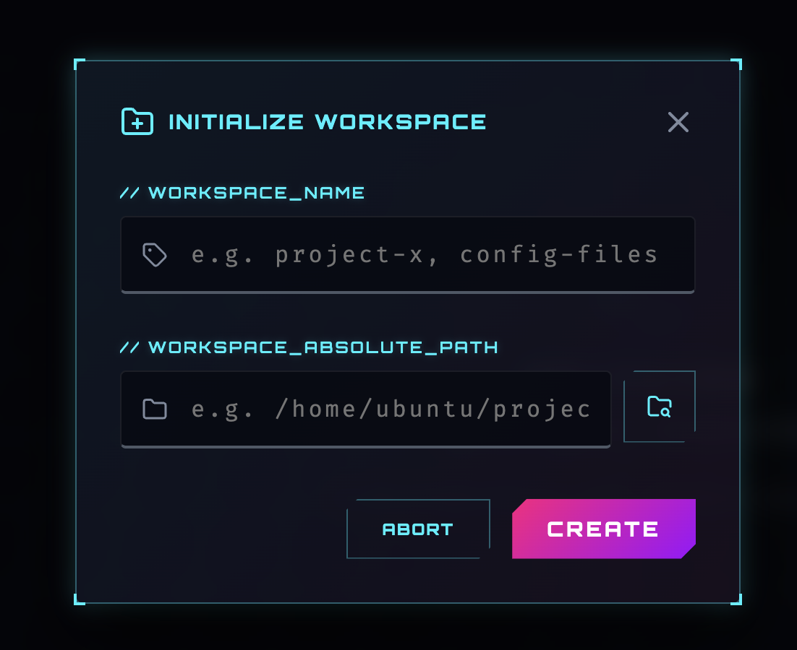
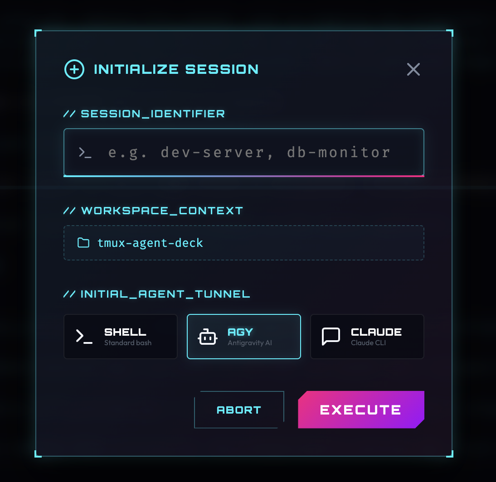
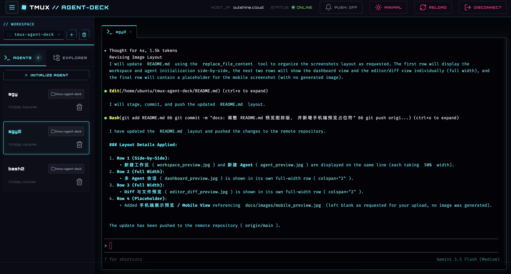
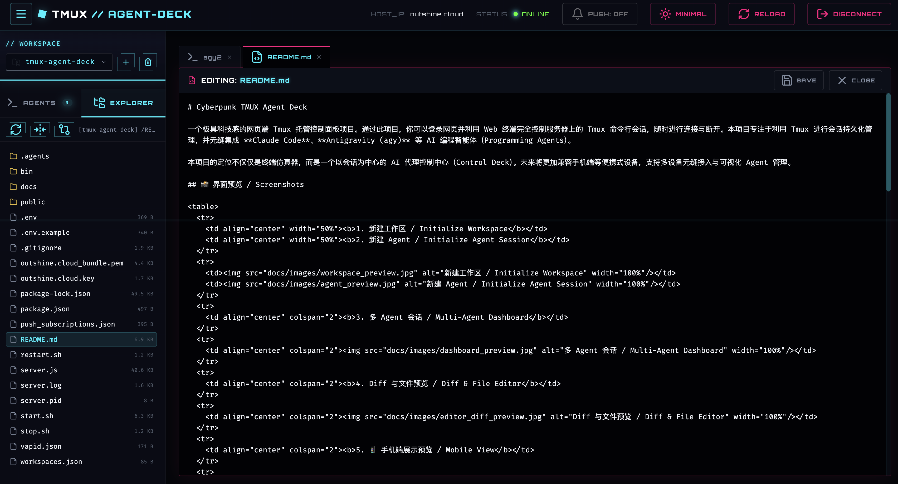
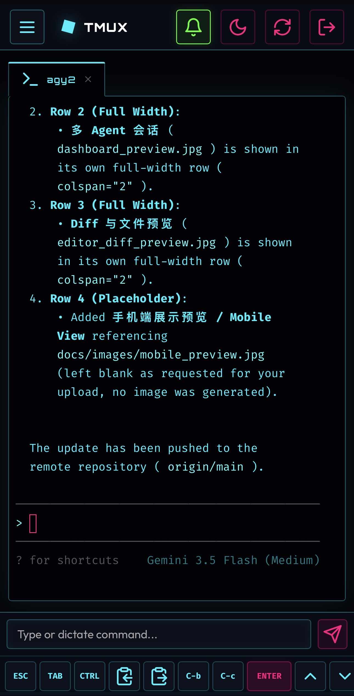

# Cyberpunk TMUX Agent Deck

一个极具科技感的网页端 Tmux 托管控制面板项目。通过此项目，你可以登录网页并利用 Web 终端完全控制服务器上的 Tmux 命令行会话，随时进行连接与断开。本项目专注于利用 Tmux 进行会话持久化管理，并无缝集成 **Claude Code**、**Antigravity (agy)** 等 AI 编程智能体（Programming Agents）。

本项目的定位不仅仅是终端仿真器，而是一个以会话为中心的 AI 代理控制中心（Control Deck）。未来将更加兼容手机端等便携式设备，支持多设备无缝接入与可视化 Agent 管理。

## 📸 界面预览 / Screenshots

<table>
  <tr>
    <td align="center" width="50%"><b>1. 新建工作区 / Initialize Workspace</b></td>
    <td align="center" width="50%"><b>2. 新建 Agent / Initialize Agent Session</b></td>
  </tr>
  <tr>
    <td></td>
    <td></td>
  </tr>
  <tr>
    <td align="center" colspan="2"><b>3. 多 Agent 会话 / Multi-Agent Dashboard</b></td>
  </tr>
  <tr>
    <td align="center" colspan="2"></td>
  </tr>
  <tr>
    <td align="center" colspan="2"><b>4. Diff 与文件预览 / Diff & File Editor</b></td>
  </tr>
  <tr>
    <td align="center" colspan="2"></td>
  </tr>
  <tr>
    <td align="center" colspan="2"><b>5. 📱 手机端展示预览 / Mobile View</b></td>
  </tr>
  <tr>
    <td align="center" colspan="2"></td>
  </tr>
</table>

---

## 🌟 核心特性

- 🔒 **安全访问控制**：采用基于 JWT 的单密码认证（主密码在环境变量中配置，支持 HTTP-Only Cookie 保持会话）。
- 🎨 **赛博霓虹设计**：基于暗黑极客风格精心打造，拥有发光特效、科幻扫描线、动态霓虹边框与平滑的微交互动画。
- 🤖 **AI 编程智能体集成**：
  - 在创建 Tmux 会话时，可一键选择直接运行 **Claude Code** 或 **Antigravity (agy)** 等编程 Agent。
  - Tmux 会话持久化：即使关闭浏览器，AI Agent 的运行状态和上下文也会在服务器端继续保持，随时可以重连查看。
- 🖥️ **Tmux 会话交互**：
  - 在侧边栏实时扫描和列出所有活跃的 Tmux 会话（附带时间戳和“已挂载/未挂载”状态点）。
  - 支持直接在网页中创建新会话（自动附带合法性正则匹配）。
  - 支持销毁（Kill）任意指定会话。
- ⚡ **毫秒级终端连接**：使用 `xterm.js` 配合 WebSockets (`socket.io`) 和服务器 pseudo-terminal (`node-pty`) 实时对接，键盘响应极快。
- 📐 **自适应缩放 (Auto-Fit)**：当浏览器窗口大小发生改变时，自动重新计算终端行列数并对齐远程 Tmux 实例。
- 📡 **PWA 主动推送通知 (Web Push)**：
  - 整合 Web Push (VAPID 协议) 与 Service Worker，支持在后台甚至浏览器关闭时接收终端会话重要事件。
  - **AI 动作推送 Hook**：当 AI 智能体 (Agy / Claude) 触发特定长耗时操作或需要权限审批时，调用内置 `/usr/local/bin/deck-notify` 命令行工具实时推送通知至订阅设备。
  - **智能免打扰机制**：在用户正聚焦查看当前会话时，系统将智能绕过推送，避免产生重复无谓的通知打扰。
- 💬 **IM 即时通讯集成 (Telegram Bot)**：
  - **双向命令与控制 (C2)**：支持列出会话、切换活动会话、截取实时屏幕内容，甚至直接通过 IM 发送文本进行命令行键盘输入。
  - **交互式审批推送**：当 AI 智能体请求授权时，可在 Telegram 直接点击 `✅ 允许` 或 `❌ 拒绝` 按钮进行一键反馈，随后系统会自动启动终端状态监视并回传结果。
  - **单次免密 Magic Link**：支持在 IM 中获取 60 秒内单次有效的免密登录链接，方便在移动端快捷进入控制大厅。

---

## 🛠️ 快速启动

### 1. 配置环境

在项目根目录下查看或编辑 `.env` 文件。该文件包含了主要的配置项：

```env
PORT=80
PASSWORD=your_secure_password
JWT_SECRET=your_jwt_secret_key
DEFAULT_SHELL=/bin/bash
```

> [!IMPORTANT]
> **安全警示**：将该项目部署于公网前，请务必修改 `.env` 中的 `PASSWORD` 和 `JWT_SECRET`，防止未经授权的终端访问！

### 2. 启动服务

在项目目录下执行以下指令运行程序：

```bash
# 启动项目（脚本会自动在后台运行服务，并支持生成强密码/密钥）
sudo ./start.sh
```

服务运行后，控制台会输出运行信息：
```text
==================================================
🌟 Tmux Agent Deck - Background Control Script 🌟
==================================================
[*] Using Node binary: /home/ubuntu/.nvm/versions/node/v26.4.0/bin/node
[*] Starting Tmux Agent Deck in the background...
[✓] Started successfully! PID: 50533
[✓] Log file: server.log
--------------------------------------------------
🔗 URL:      https://outshine.cloud
🔑 Password: your_secure_password
--------------------------------------------------
To stop the server, run: ./stop.sh
```

### 停止服务
如需停止正在后台运行的服务器，请执行：
```bash
sudo ./stop.sh
```

> **权限与端口说明**：默认使用 `80` 和 `443`（如果配置了 HTTPS）等特权端口，因此通常需要使用 `sudo` 运行。如果未在 `.env` 中配置证书，系统会自动降级在 HTTP (端口 80) 下启动。


### 3. 打开网页

1. 访问浏览器：`http://localhost` 或 `http://<服务器IP>`（端口 80 可省略端口号）。
2. 页面会重定向到授权中心 `/login.html`。
3. 输入您的主访问密码（在 `.env` 中设置的 `PASSWORD` 值），点击 **AUTHENTICATE** 登录。
4. 授权成功后，即可进入控制大厅管理与连接您的 Tmux 终端，并启动 AI 编程智能体！

---

## 🤖 Telegram 机器人集成 / Telegram Bot Integration

本项目集成了一个 Telegram 机器人，您可以通过 IM 即时通讯工具接收智能体通知、执行终端指令，甚至进行交互式操作审批。

### 1. 配置 Telegram Bot
在根目录下的 `.env` 文件中配置以下环境变量（Bot Token 可通过向 [@BotFather](https://t.me/BotFather) 申请获得）：

```env
# Telegram 机器人配置
TELEGRAM_BOT_TOKEN=your_telegram_bot_token
TELEGRAM_BOT_USERNAME=your_telegram_bot_username # 可选，若不填写启动时会自动通过 API 获取
```

配置完成后，使用 `sudo ./restart.sh` 重启服务。

> [!NOTE]
> Telegram 机器人采用 **Webhook** 模式（API 接口为 `https://<你的域名>/api/im/telegram/webhook`），因此需要配置有效的 `SSL` 证书及公网可访问的 `DOMAIN_NAME` 域名。

### 2. 账号绑定 (User Binding)
1. 登录网页控制面板，点击控制栏右侧的 **IM BOT** 按钮。
2. 页面会弹出绑定二维码及链接。
3. 点击链接或扫描二维码（链接格式如：`https://t.me/your_bot?start=xxxxxx`）跳转至 Telegram 并点击 **Start** 按钮。
4. 绑定成功后，机器人会向您发送欢迎消息，此时会话控制通道已开启。

### 3. 支持的 IM 指令 (IM Commands)
在 Telegram 中，你可以使用以下指令来查询与控制你的 Tmux 会话：
- `/list` — 🖥️ 列出服务器上当前所有的 Tmux 会话以及它们的挂载状态。
- `/switch <会话名>` — 🎯 切换当前的活动会话，接下来的非指令消息都会发送到该会话。
- `/status` — 📸 截取并查看当前活动会话屏幕的最后 20 行终端内容。
- `/link` 或 `/login` — 🔗 获取一个 60 秒内单次有效的免密登录链接，点击可一键安全登录 Web 终端面板。
- `/help` — ❓ 查看支持的指令帮助。

### 4. 远程键盘输入与终端监视 (Remote Input & Monitoring)
- **直接输入**：除指令外，你可以在 Telegram 中直接发送任何文本消息，Bot 会将其作为键盘输入（自动附带 Enter）下发至当前活动会话中。
- **状态监视**：发送输入后，Bot 会自动开启终端监视器（最长 5 分钟），并在命令执行结束（终端输出静止 3 秒或命令运行 12 秒无变化）时，将最后 20 行输出自动推送给您。

### 5. 交互式动作审批 (Interactive Action Approval)
当运行在 Tmux 里的 AI 智能体 (Agy 或 Claude Code) 触发需要授权的动作（例如：运行指令、修改/查看文件等）时，Telegram 机器人会发出带有交互式按钮的通知：
- **操作按钮**：包含 `✅ 允许 (Approve)` 和 `❌ 拒绝 (Deny)` 两个内联按钮。
- **一键决策**：在 Telegram 中点击相应按钮即可立即将 `y` 或 `n` 发送至对应的 Tmux 终端，无需登录网页操作。
- **自动闭环**：做出决策后，机器人会自动移除按钮、记录决策结果并进入终端状态监视，命令执行完毕后自动把终端的最新输出推送给您。

---

## 📂 项目结构

- [server.js](file:///home/ubuntu/tmux-agent-deck/server.js) — 基于 Express + Socket.io + Node-PTY 的 Web 主进程
- [im-bot.js](file:///home/ubuntu/tmux-agent-deck/im-bot.js) — 即时通讯（Telegram）机器人后端核心，实现 Webhook 路由、指令解析与交互审批逻辑
- [bin/](file:///home/ubuntu/tmux-agent-deck/bin) — 命令行工具目录
  - [deck-notify](file:///home/ubuntu/tmux-agent-deck/bin/deck-notify) — 供系统和 AI 智能体调用的主动推送命令行通知工具
- [public/](file:///home/ubuntu/tmux-agent-deck/public) — 前端静态文件目录
  - [login.html](file:///home/ubuntu/tmux-agent-deck/public/login.html) — 赛博朋克风格身份登录认证页面
  - [index.html](file:///home/ubuntu/tmux-agent-deck/public/index.html) — 主控终端与会话看板控制页面
  - [css/style.css](file:///home/ubuntu/tmux-agent-deck/public/css/style.css) — 霓虹视觉系统与布局样式表
  - [js/app.js](file:///home/ubuntu/tmux-agent-deck/public/js/app.js) — 前端核心逻辑（Xterm.js 配置与 WebSocket 数据流）
  - [js/im-bot-client.js](file:///home/ubuntu/tmux-agent-deck/public/js/im-bot-client.js) — 前端 IM 绑定、状态查询与解绑核心逻辑
  - [sw.js](file:///home/ubuntu/tmux-agent-deck/public/sw.js) — 用于注册与接收通知的 PWA Service Worker
  - [manifest.json](file:///home/ubuntu/tmux-agent-deck/public/manifest.json) — 包含图标和主题设置的 Web 应用清单文件
  - [images/](file:///home/ubuntu/tmux-agent-deck/public/images) — 静态图片资源目录 (包含 PWA 图标 icon-192.png)
