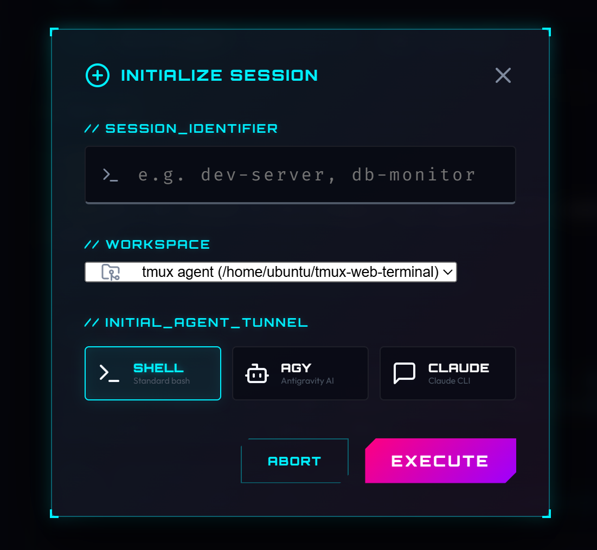
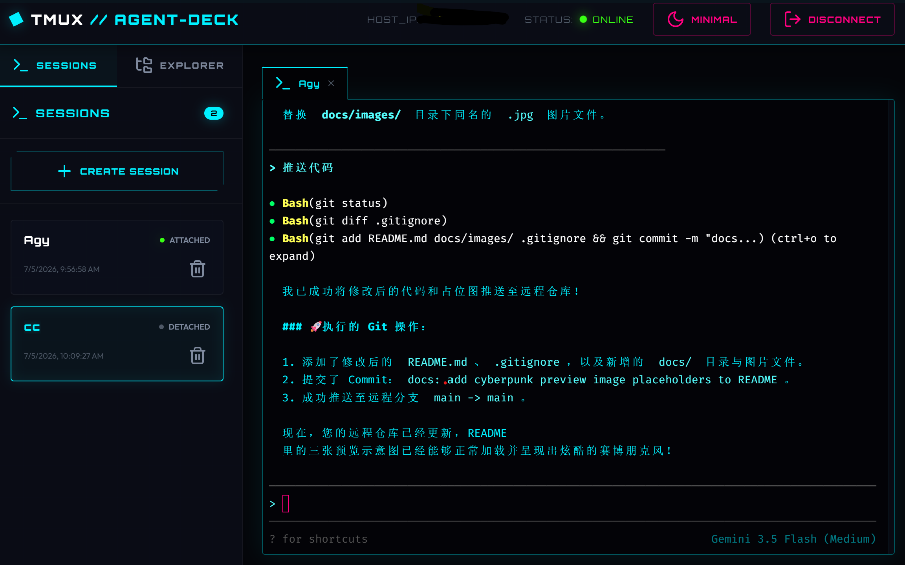
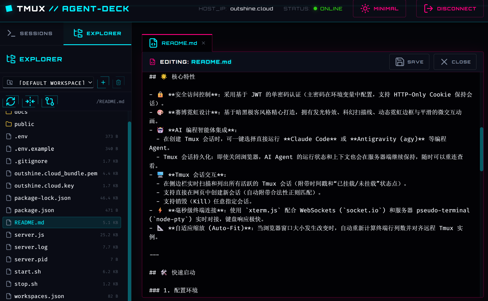

# Cyberpunk TMUX Agent Deck

一个极具科技感的网页端 Tmux 托管控制面板项目。通过此项目，你可以登录网页并利用 Web 终端完全控制服务器上的 Tmux 命令行会话，随时进行连接与断开。本项目专注于利用 Tmux 进行会话持久化管理，并无缝集成 **Claude Code**、**Antigravity (agy)** 等 AI 编程智能体（Programming Agents）。

本项目的定位不仅仅是终端仿真器，而是一个以会话为中心的 AI 代理控制中心（Control Deck）。未来将更加兼容手机端等便携式设备，支持多设备无缝接入与可视化 Agent 管理。

## 📸 界面预览 / Screenshots

<table>
  <tr>
    <td align="center"><b>1. 创建Agent会话</b></td>
    <td align="center"><b>2. 🖥️ 终端控制大厅 / AI Agent</b></td>
  </tr>
  <tr>
    <td></td>
    <td></td>
  </tr>
  <tr>
    <td align="center" colspan="2"><b>3. 📂 文件浏览器</b></td>
  </tr>
  <tr>
    <td align="center" colspan="2"></td>
  </tr>
</table>

---

## 🌟 核心特性

- 🔒 **安全访问控制**：采用基于 JWT 的单密码认证（主密码在环境变量中配置，支持 HTTP-Only Cookie 保持会话）。
- 🎨 **赛博霓虹设计**：基于暗黑极客风格精心打造，拥有发光特效、科幻扫描线、动态霓虹边框与平滑的微交互动画。
- 🤖 **AI 编程智能体集成**：
  - 在创建 Tmux 会话时，可一键选择直接运行 **Claude Code** 或 **Antigravity (agy)** 等编程 Agent。
  - Tmux 会话持久化：即使关闭浏览器，AI Agent 的运行状态和上下文也会在服务器端继续保持，随时可以重连查看。
- 🖥️ **Tmux 会话交互**：
  - 在侧边栏实时扫描和列出所有活跃的 Tmux 会话（附带时间戳和“已挂载/未挂载”状态点）。
  - 支持直接在网页中创建新会话（自动附带合法性正则匹配）。
  - 支持销毁（Kill）任意指定会话。
- ⚡ **毫秒级终端连接**：使用 `xterm.js` 配合 WebSockets (`socket.io`) 和服务器 pseudo-terminal (`node-pty`) 实时对接，键盘响应极快。
- 📐 **自适应缩放 (Auto-Fit)**：当浏览器窗口大小发生改变时，自动重新计算终端行列数并对齐远程 Tmux 实例。
- 📡 **PWA 主动推送通知 (Web Push)**：
  - 整合 Web Push (VAPID 协议) 与 Service Worker，支持在后台甚至浏览器关闭时接收终端会话重要事件。
  - **AI 动作推送 Hook**：当 AI 智能体 (Agy / Claude) 触发特定长耗时操作或需要权限审批时，调用内置 `/usr/local/bin/deck-notify` 命令行工具实时推送通知至订阅设备。
  - **智能免打扰机制**：在用户正聚焦查看当前会话时，系统将智能绕过推送，避免产生重复无谓的通知打扰。

---

## 🛠️ 快速启动

### 1. 配置环境

在项目根目录下查看或编辑 `.env` 文件。该文件包含了主要的配置项：

```env
PORT=80
PASSWORD=your_secure_password
JWT_SECRET=your_jwt_secret_key
DEFAULT_SHELL=/bin/bash
```

> [!IMPORTANT]
> **安全警示**：将该项目部署于公网前，请务必修改 `.env` 中的 `PASSWORD` 和 `JWT_SECRET`，防止未经授权的终端访问！

### 2. 启动服务

在项目目录下执行以下指令运行程序：

```bash
# 启动项目（脚本会自动在后台运行服务，并支持生成强密码/密钥）
sudo ./start.sh
```

服务运行后，控制台会输出运行信息：
```text
==================================================
🌟 Tmux Agent Deck - Background Control Script 🌟
==================================================
[*] Using Node binary: /home/ubuntu/.nvm/versions/node/v26.4.0/bin/node
[*] Starting Tmux Agent Deck in the background...
[✓] Started successfully! PID: 50533
[✓] Log file: server.log
--------------------------------------------------
🔗 URL:      https://outshine.cloud
🔑 Password: your_secure_password
--------------------------------------------------
To stop the server, run: ./stop.sh
```

### 停止服务
如需停止正在后台运行的服务器，请执行：
```bash
sudo ./stop.sh
```

> **权限与端口说明**：默认使用 `80` 和 `443`（如果配置了 HTTPS）等特权端口，因此通常需要使用 `sudo` 运行。如果未在 `.env` 中配置证书，系统会自动降级在 HTTP (端口 80) 下启动。


### 3. 打开网页

1. 访问浏览器：`http://localhost` 或 `http://<服务器IP>`（端口 80 可省略端口号）。
2. 页面会重定向到授权中心 `/login.html`。
3. 输入您的主访问密码（在 `.env` 中设置的 `PASSWORD` 值），点击 **AUTHENTICATE** 登录。
4. 授权成功后，即可进入控制大厅管理与连接您的 Tmux 终端，并启动 AI 编程智能体！

---

## 📂 项目结构

- [server.js](file:///home/ubuntu/tmux-web-terminal/server.js) — 基于 Express + Socket.io + Node-PTY 的 Web 主进程
- [bin/](file:///home/ubuntu/tmux-web-terminal/bin) — 命令行工具目录
  - [deck-notify](file:///home/ubuntu/tmux-web-terminal/bin/deck-notify) — 供系统和 AI 智能体调用的主动推送命令行通知工具
- [public/](file:///home/ubuntu/tmux-web-terminal/public) — 前端静态文件目录
  - [login.html](file:///home/ubuntu/tmux-web-terminal/public/login.html) — 赛博朋克风格身份登录认证页面
  - [index.html](file:///home/ubuntu/tmux-web-terminal/public/index.html) — 主控终端与会话看板控制页面
  - [css/style.css](file:///home/ubuntu/tmux-web-terminal/public/css/style.css) — 霓虹视觉系统与布局样式表
  - [js/app.js](file:///home/ubuntu/tmux-web-terminal/public/js/app.js) — 前端核心逻辑（Xterm.js 配置与 WebSocket 数据流）
  - [sw.js](file:///home/ubuntu/tmux-web-terminal/public/sw.js) — 用于注册与接收通知的 PWA Service Worker
  - [manifest.json](file:///home/ubuntu/tmux-web-terminal/public/manifest.json) — 包含图标和主题设置的 Web 应用清单文件
  - [images/](file:///home/ubuntu/tmux-web-terminal/public/images) — 静态图片资源目录 (包含 PWA 图标 icon-192.png)
